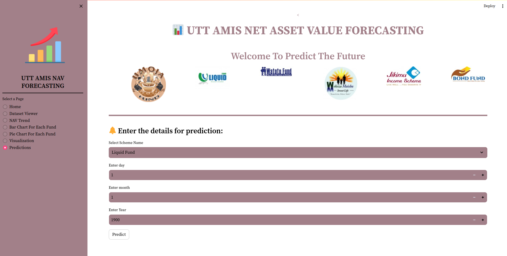

# UTT AMIS NET ASSET VALUE FORECASTING

This repository contains a data science and machine learning project aimed at forecasting Net Asset Value (NAV) for various investment funds. This is the project developed due to the fruits of Training that i got from Tanzania Data Lab (dLab Tanzania)

## Table of Contents

- [Introduction](#introduction)
- [Objectives](#objectives)
- [Significance](#significance)
- [Methodology](#methodology)
- [Tools Used](#tools-used)
- [Implementation](#implementation)
- [Conclusion](#conclusion)
- [Recommendations](#recommendations)
- [Contacts](#contacts)

## Introduction

Investors often face challenges in predicting the future value of their investments, leading to potential losses. This project focuses on forecasting Net Asset Value (NAV) for investment funds using data science and machine learning techniques.

## Objectives

### Main Objective

The primary goal of this project is to develop a predictive tool that can forecast the future trends of specific investment funds over the next six months. This tool aims to assist investors and asset managers in making data-driven investment decisions and optimizing their portfolios.

### Specific Objectives

1. Optimize the predictive model for better performance.
2. Collect and preprocess data from UTT AMIS (a Tanzanian firm) for analysis.
3. Incorporate the model into a user-friendly web or mobile application for potential investors.
4. Visualize the data to gain insights into fund behavior.
5. Develop a machine learning model capable of forecasting the future trends of investment funds over the next six months.

## Significance

Accurate NAV forecasting offers several benefits:

- Reduced risk for investors through informed decision-making.
- Effective risk management to protect investments during market fluctuations.

## Methodology

The project follows the Cross-Industry Standard Process for Data Mining (CRISP-DM) methodology. The stages include:

1. Data and Business Understanding
2. Data Preparation
3. Modelling
4. Evaluation
5. Deployment

## Tools Used

The main tools and libraries utilized in this project include:

- Python programming language
- Jupyter Notebooks
- Scikit-learn for machine learning
- Facebook Prophet for time series forecasting
- Numpy, Pandas, Matplotlib, Seaborn, and D-Tale for data manipulation and visualization
- VS Code, Git, Microsoft Word, Microsoft PowerPoint, Gmail, GitHub, and Google Drive for project management and communication
- Streamlit for web-based model deployment

## Implementation

The project implementation includes various stages:

- Business Understanding: The goal is to predict NAV prices to improve portfolio strategies and risk management.
- Data Understanding: Data was obtained from UTT AMIS and contains NAV values for six different funds from 2017-2022.
- Data Preparation: Data was cleaned, converted, and feature-engineered for analysis.
- Modelling: Time series forecasting using the Facebook Prophet algorithm, with model optimization.
- Evaluation: Model performance assessed using RMSE, MSE, MAE, and R-squared score.
- Deployment: A web-based application was created to showcase and predict NAV/unit prices, hosted on Streamlit Cloud.

## Conclusion

This project provided valuable insights into data science and its practical applications in the field of investment forecasting. The Prophet model showed promise in automatically detecting seasonality patterns and providing uncertainty estimates for predictions. Each fund exhibited unique trends and seasonality patterns in their NAV per unit values.

## Recommendations

- Consider external factors and risks that may impact fund performance.
- Tailor investment strategies based on fund stability and volatility.
- Expand the dataset with additional features for better analysis and prediction.

## Contacts

If you have any questions, suggestions, or would like to collaborate, feel free to get in touch with me:

- **Email**: [godfreyenos360@gmail.com](mailto:godfreyenos360@gmail.com)
- **GitHub**: [Godie360](https://github.com/Godie360)
- **LinkedIn**: [godfrey-enosh-b35a98256](https://www.linkedin.com/in/godfrey-enosh-b35a98256/)

**_ "Your work is going to fill a large part of your life, and the only way to be truly satisfied is to do what you believe is great work. And the only way to do great work is to love what you do." – Steve Jobs _**
